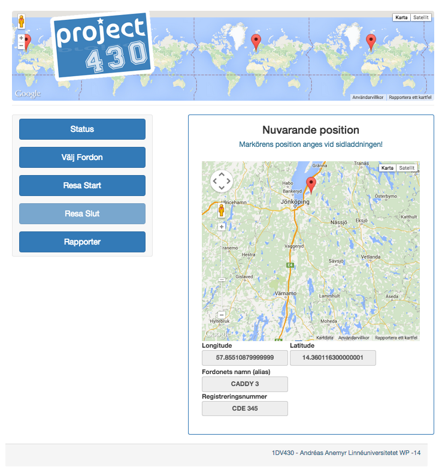
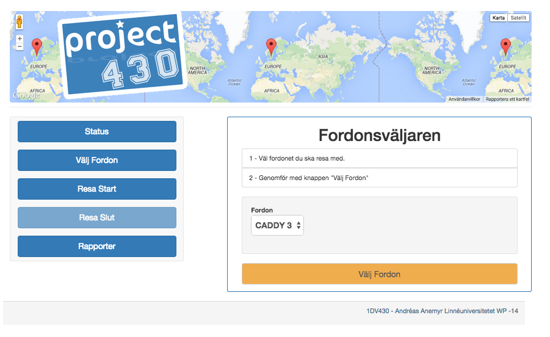
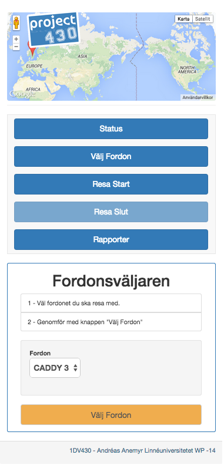
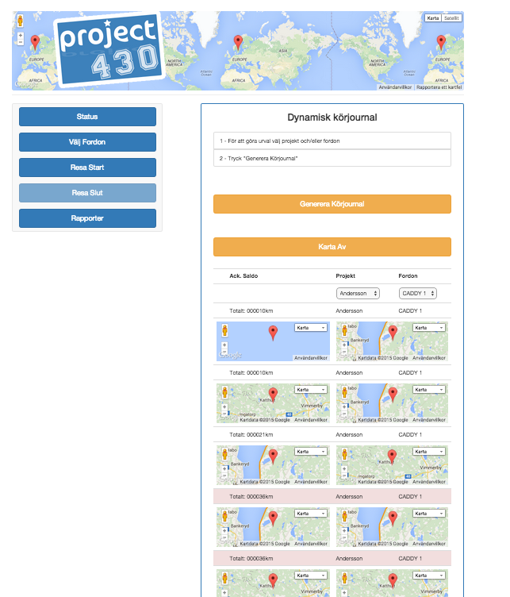

# Project430

***

##Abstrakt
Följande rapport är ett resultat av författarens erfarenheter från ett 10-veckors utvecklingsprojekt med en scrum-liknande arbetsprocess. Rapporten försöker även belysa några av de problem och möjligheter man kan tänkas ställas inför när man ska sätta en vision för ett projekt i utbyte med bla slutanvändaren. Hur man avgränsar visionen för att sedan genomföra denna till att utvecklas/genomföras till en programvara, med lyckat resultat.

Därutöver bör man som läsare även ha en insikt i att rapportförfattaren inte har speciellt mycket av tidigare erfarenhet inom liknande utvecklingsprojekt av kursens/projektets omfattning. I omfattning menas i detta fall att i den iterativa utvecklingen ingår det ett flertal fastställda "byggstenar" som ska läggas på rätt plats och i rätt ordning. Rapporten bör således innebära vara intressant för samtliga aktörer som kan ingå i utvecklingsprojekt och därmed få en insikt om vad som kan vara svårt och kanske extra viktigt att tänka på inför kommande projekt för läsaren.

## Inledning och bakgrund

### Syfte
Syftet med projektet är att praktiskt genomföra ett ganska omfattande utvecklingsprojekt som återkopplar till följande nedanstående tekniker som studerats under det första året som webbprogrammerare.

* HTML/CSS
* Objektorienterad Programmering.
* Iterativ mjukvaruutveckling (Unified Process).
* Databasteknik
* Flerlagerapplikation

### Projektbilder
***
##### Status
Bilden visar sidan man når när man klickar på knappen status.

***
##### Fordonsväljaren
Bilden visar sidan man når när man klickar på knappen "Välj Fordon"

***
##### Fordonsväljaren - Responsivitet i design!
Bild som påvisar implementation av bootstrap med lyckat resultat.

***
##### Rapporter
Bid som visar hur rapportverktyget som genererar dynamisk rapport som möjliggjorts genom reseloggning av rutter som gjorts med ett fordon. Olika sorteringsmöjligheter finns beroende på användarens behov.

***

#### Mål
Projektets huvudsakliga mål var att genomföra ett lyckat projekt med ovanstående tekniker och försöka att beakta vad man bör tänka på för att respektive teknik ska genomföras på ett professionellt sätt. Även om andra språk och tekniker nyttjas i projektet, än vad som tidigare studerats i programmet, kommer översättning/tolkning försöka att göras för att uppnå bra genomförande och resultat. Säkerhet, kodkvalité och struktur och ordning är viktiga ledord för projektet. Att genom den iterativa processtyrningen få styrning på sina tankar och att behålla fokus på det väsentliga för applikationens utvecklingsfas var ett huvudsakligt mål för författaren.

#### Vision (Affärsidé)
En applikation som är mer ett hjälpmedel än ett hinder för att skriva körjournaler på ett bra och riktigt sätt. Vid en komplett loggning av en resa i körjournalen har kordinater sparats till databas - både vid resans start och slut. Utöver kordinaterna så bör mätarställningen loggas för respektive tillfälle. Reseloggen skulle även kunna spara loggen specifikt för ett projekt gällandes för företaget som nyttjar applikationen - alternativt ska resan kunna loggas som en privat resa. Genom dessa sparade data kan man genom ett rapportverktyg få fram data genom olika sorteringbegrepp. (prokekt eller fordon. Alternativt att man anger både ett projekt och ett fordon)

#### Arbetssätt
För projketet har en iterativ utvecklingsprocess använts. Processen innebär ett i förväg bestämt tillvägagångssätt för hur ett projekt kan indelas i olika faser och vilka saker man bör tänka på i de olika faserna. Beroende på vilken fas man är har man fokus på olika saker såsom design, analys, design etc. Det här projektets utvecklingsfaser låg gemensamt med ytterligare tre kurskamrater. Varje vecka mestadels på måndagar levererade man föregåend veckas jobb för feedback och presenterade en ny veckoplanering (iteration)

#### Genomförande/teknik

Nedan listade tekniker och programvaror har specifikt använts för att utveckla applikationen.
Krav för att applikation ska fungera på en publceringsserver är php och mysql databas. Vidare behöver en användare konfigureras som har rätt att exekvera lagrade procedurer.

#####Tekniklista
* Adobe CS4 Illustrator och Photoshop
* [Bootstrap] (http://getbootstrap.com/) Ramverk som erbjuder responsiv design
* CSS
* [Dploy.io] (http://dploy.io/) "Deploya" med ett klick. Från IDE till publiceringsserver
* [Github] (https://github.com/) Versionshantering för projektet i sin helhet
* [Google Maps JavaScript API] (https://developers.google.com/maps/documentation/javascript/) - 
* HTML5
* Javascript Klientspråk nödvändig på klient för applikation för att kordinater ska kunna sparas.
Dynamsika kartor och markörer.
* [MySQL] (https://www.mysql.com/) Databas
* [MySQL Workbench] (https://dev.mysql.com/downloads/workbench/) Verktyg för att administrera mysql databas
* [Orderland] (http://www.oderland.se/) Hosting för skarpa publiceringar under utvecklingsprojekt. [xponeras.se/1dv430](http://xponeras.se/1dv430)
* [Php](http://php.net/) - Serversidespråk
* [PhpStorm](https://www.jetbrains.com/phpstorm/) - IDE
* [Vagrant](https://www.vagrantup.com/) - Utvecklingserver som kan köras med lika konfiguration på olka operativsystem.
* [VirtualBox](https://www.virtualbox.org/) Programvara som vagrant behöver för den virtuell server.

##Positiva erfarenheter
Den första sak jag känner som är riktigt bra för kommande projekt jag kommer vara delaktig i är att jag nu har fått en grundlig mall att jobba efter. Den har jag fått genom att praktisera den iterativa utvecklingsprocessen. Jag ser nu betydligt bättre hur man kan bryta ned ett större projekt till hanterbara bitar för att kunna hålla fokus. Det har varit bra att man träffats i en "teamgrupp" varje vecka tillsammans med handledare. Det har för min del inneburit att man måste försöka jobba med det som är väsentligt just nu för att kunna leverera rätt leverans till nästkommande vecka. Jag har blivit mycket bättre på att se vad jag ska göra och att prioritera vad jag SKA göra. Jag känner också att jag lyckats skriva en applikation som är uppdelad i lager och som nu och i framtiden innebär att kod som ännu inte producerats (i den här och andra program) har en plats där den hör hemma på. Jag har blivit mycket bättre på att få en bättre struktur i kod. Det hjälper i alla fall mig oerhört mycket!
Måste också nämna att jobba mot Google Maps API var positivt och kul!

I framtiden kommer jag att använda diagrammet för unified process för att påminna mig om vart jag ligger i processen och vad man bör koncentrera sig på. Då tror jag att mina iterationer blir än tydligare och specifika.

##Negativa erfarenheter
Kan ha blandat in på tok för många tekniker för att ens få till en körbar utvecklingsmiljö som kunde publiceras på en skarp server och att ha ett bra flöde från IDE till publicering. Med facit i hand kände jag att att jag borde haft lite mer tid till att fixa till lite grafikst material i ett tidigare skede av applikation. Även om jag fixade lite med mockups och funderat på interaktionsflödet så är känslan att jag skulle lagt än mer tid på detta. Orsaken är att jag gillar att jobba mot resultat som man kan se visuellt. Att ha en bild att titta på även om inte underliggande kod finns.

För att förhindra att detta händer i framtiden kommer jag värdesätta en eller flera mockuper högre att ha att jobba mot som mål. Jag kommer även att försöka förhindra alltför många nya tekniker som ska interagera med varandra då det blir väldigt mycket ny information att ta in samtidigt som det ska produceras...

Enhetesterna med phpUnit blev det inte som jag hoppats på. Jag har helt enkelt inte hunnite med att lära mig koda dessa. Kändes bra att jag fixade test id och så i baskraven och tanken var att testerna skulle ligga som källkod fullt spårbara. 

För att förhindra att detta händer igen kommer jag att göra något minibaskrav och minitestfall som hör ihop så man känner att man är igång. Jag upplever att oftast är det svårast att faktiskt komma igång och att saker egentligen inte är så stora svåra. Man bör kanske medvetet vid en ny teknik göra saker smått och lätt medvetet för att känna att man är på gång?

##Sammanfattning
Jag uppfyllde nästan hela visionens baskrav. Dessutom gjorde jag detta med en responsiv design vilket jag inte hade lagt upp som mål. Så totalt sätt är jag mycket nöjd med det som jag lyckats genomföra. Att jobba med API:er tycker jag lyfter applikationen flera snäpp på en enda gång. Det var en fantastisk känsla när man känner att man kan spara ned en reselogg som i efterhand kan användas för att rendera ut markörers positioner på en karta och presentera data på genom valfria sorteringsalternativ. Känner att det objektorienterade tänket mer och mer börjar innfinna sig. Så absolut, jag har vuxit som programmerare under kursens framfart!

#### Framtiden?
Jag hann inte med att implementera validering vare sig på klient eller server då jag var mer intresserad att få till baskraven vid kursens slut. Jag tog beslut om detta ganska tidigt då jag kände att jag inte hade mäktat med att få till fungerande validering i php utan något ramverket. Det hade tagit för mycket tid av den tilldelade projekttiden som jag upplevde det. 
Vid en vidareutveckling av programvaran kommer validering att ligga med i baskraven omgående. Baskraven kommer kompletteras!

Min känsla är att visionen är bra. Det går att om man ytterligare utvecklar applikationen att få den riktigt bra. Jag har försökt att bygga den utan javascriptberoende (förutom geolocation) och lyckats. Jag funder på att ersätta kompletta omladdningar av sidor till att ersättas med ajax. I vilket fall anser jag det vara bra att man först utvecklar applikationer utan javascript. Användarenr kan då ta eget beslut om en komplett sidomladdning ska utföras eller inte. Framtiden får utvisa hur det blir med saken. I vilket fall kommer applikationen att ytterligare förädlas. Dessutom vill jag avsluta med att säga jag är väldigt nöjd med mitt genomförande av kursen. Min ambitionsnivå var genomgående hög under kursen!

